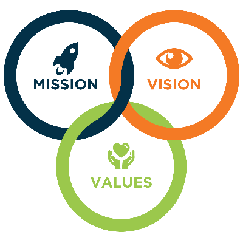
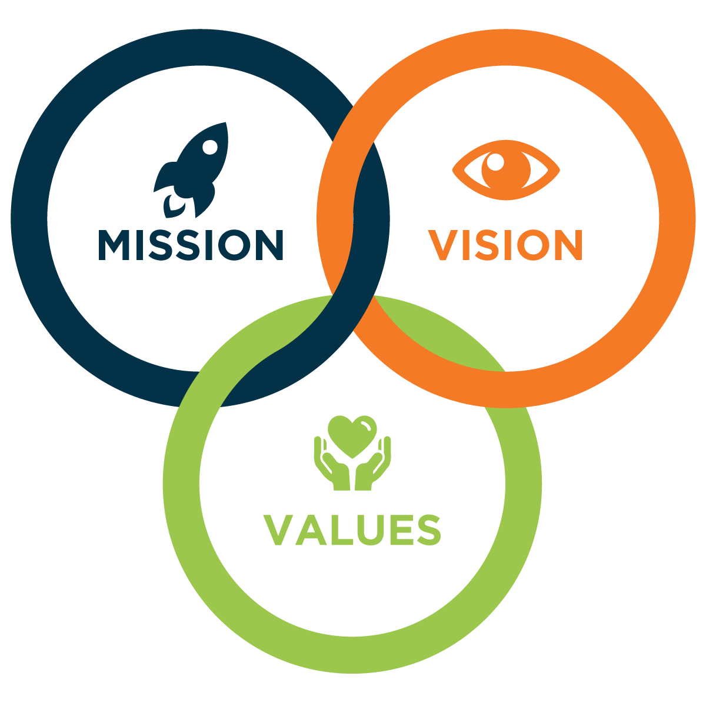
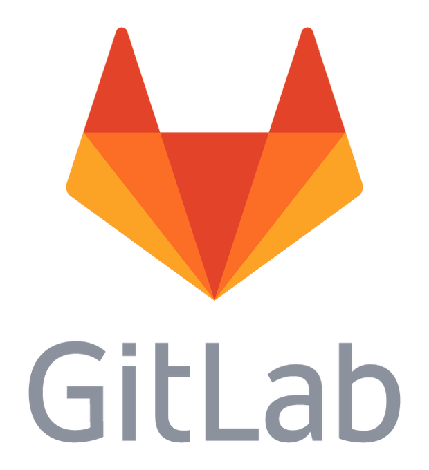
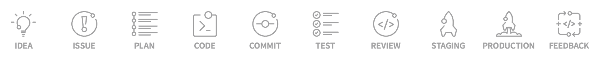

### IT 
#### @color[blue](Mission), @color[orange](Vision), @color[green](Values)

~60 min 

Note:
* According to managment principles every organization should have Mission, vision and values
* today will cover  Vision and Values
  
---
### Who am I?
- short intro

---

### the @color[blue](Goal)
@ul
- Collaboration
- Breaking the silos
- Fast feedback loops
- @color[green](Transparency) of decision-making:
  - who
  - what
  - where
  - when
  - why
  - @color[red](how!)
@ulend

Note:
* 5W + How
* context
---
#### Solution
@div[right-60]
     
@ul
- a tool from @color[red](DevOps) toolbox
@ulend
@divend

@div[left-40 fragment]
 

@divend

---

#### What is  @color[orange](GitLab)? 

@snap[south-west]
@ul
  - full life-cycle: from @size[2.0em](@color[green](idea)) to @size[0.5em](@color[blue](product))  
  
@ulend
@snapend

Note:
* Not all BIG ideas in the beginning turns into big products/results. 
* 1. IDEA: Every new proposal starts with an idea, which usually come up in a chat. For this stage, GitLab integrates with Mattermost.
* 2. ISSUE: The most effective way to discuss an idea is creating an issue for it. Your team and your collaborators can help you to polish and improve it in the issue tracker.
* 3. PLAN: Once the discussion comes to an agreement, it's time to code. But wait! First, we need to prioritize and organize our workflow. For this, we can use the Issue Board.
* 4. CODE: Now we're ready to write our code, once we have everything organized.
* 5. COMMIT: Once we're happy with our draft, we can commit our code to a feature-branch with version control.
* 6. TEST: With GitLab CI, we can run our scripts to build and test our application.
* 7. REVIEW: Once our script works and our tests and builds succeeds, we are ready to get our code reviewed and approved.
* 8. STAGING: Now it's time to deploy our code to a staging environment to check if everything worked as we were expecting or if we still need adjustments.
* 9. PRODUCTION: When we have everything working as it should, it's time to deploy to our production environment!
* 10. FEEDBACK: Now it's time to look back and check what stage of our work needs improvement. We use Cycle Analytics for feedback on the time we spent on key stages of our process.
---
### Key features 1

 - Nr.1 distributed version control system 
 - Open-source
 - Very flexible, versatile tool
 - Mimics @color[gold](ANY) organizational model
 - Peer review
 - WIP pattern - early work review

Note:
* WIP or [WIP] or WIP:
---
### Key features 2
 - Follows @color[green](Agile), @color[blue](Dev)@color[orange](Ops) trends
 - Integrated CI/CD
 - @color[red](~~Issue~~) Idea linking with work
 - Review per line
 - Comment history
 - @color[blue](Everything) is cross-linked and referenced
 - @color[green](Colour)@color[red](red diff)
 - Effectiveness metric

Note:
* scrum, kanban, waterfall, sprint
* cycle analytics - effectiveness metric
---
### Key features 3
 - "/" friends e.g. /spend /estimate
 - GPG signing
 - Static websites
 - LFS
 - Multiple tags
 - @color[red](ONE) assignee
 - @Mention

Note:
*  static websites - gitlab pages
---
### Key features 4
 - @color[blue]("unlimited") integrations:
   -  Full featured task manager
   -  Mattermost
   -  Docker
   -  CI/CD
   -  etc. https://about.gitlab.com/applications/

---
## @color[blue](Q) / @color[green](A)?
---
### git-based workflows
1. git-flow
2. github
3. GitLab

Note:
* These by far are the most popular gitflows.
* Lets take a closer look at each of them
---
 
#### git-based workflows: @color[red](git-flow)

@div[left-50]

@divend

@div[right-50]
   
@ul
  - Father of gitflows - 2010
  - "Bit" complicated
  - Detailed
@ulend
@divend

---
#### git-based workflows: @color[red](github)

@div[left-50]

@divend

@div[right-50]
  
@ul
- Easy to adapt
- Very easy concept:
  - build small
  - fail small
  - know ASAP
@ulend
@divend

---
#### git-based workflows: @color[red](gitlab) 

@div[left-50]

@divend

@div[right-50]
   
@ul
  - Advanced version of @color[red](github flow)
  - Added environments
  - Bit more complicated
@ulend  
@divend

Note:
* testing, staging, production

---
### git-based workflows:

@div[left-50 fragment]
 

@divend

@div[right-50 fragment]
Github workflow
 

@divend

Note:
* ALWAYS ready tp deploy

---
### Git companion - @color[blue](Plain text)
  - Configs
  - Infrastructure as Code
  - Documentation + self generated
  - Documents
  - Presentations - @color[green](e.g this one)
  - Flow diagrams (mermaid) 
  - CMS - e.g. grav
  - Markup language - e.g. markdown

---

### Signs of  @size[1.5em](@color[red](FAILURE))
- Discussion ends:
    - with a smirk smile :;)
    - in silence 
    - with heads down
- GitLab lacks ~~issues~~/ideas from employees
- GitLab is used only cause management demands

Note:
* simper, smirk - kvailai sypsotis 
* GitLab is not baudziavos tool 
---
### Key to  @size[1.5em](@color[green](SUCCESS))
 - Cultural change is a  @color[magenta](MUST)
   - Blame - @color[magenta](blamelessly!) learn from failures
   - fails TEAM not a person
   - Blurred line between employers and employees
   - Same rules for @color[magenta](ALL) Gitlab users
   - Motivated employees
   - Management supports by @color[magenta](example)
   - Time

---
###  @size[1.3em](@color[gold](Feature branch)) workflow

@div[left-40]

@divend

@div[right-60]
 
@ul
- Short live branch  
- @color[red](Protect) mainstream work
- Change proposals @color[blue](ONLY!)
- Branch name - e.g. issue ref  
- Commit message name  
- @color[blue](Quality:)
  - do it for others
  - @color[blue](invest) some time
@ulend  
@divend

Note:
* commit message - present time
* quality - look at your past commits can you understand them Yourself?
* look at others commits - are they understandable? 

---
### Start with an @color[red](~~issue~~) Idea
@ul
Average @color[gold](time) spent:
- 89% 
  - formal proposal
  - discussion
  - mockups
  - design
- 11% - implementation/work
@ulend

Note:
* gitlab "Todo feature" case
* First steps - Start with an issue
* mockups - taisymai

---
## @color[blue](Q) / @color[green](A)?
---
### references

1. https://www.maine.edu/its/usit/mission-vision-values/

---?image=images/github_flow.png&position=right&size=auto 90%
---?image=images/gitlab_release_branches.png&size=auto 90%

